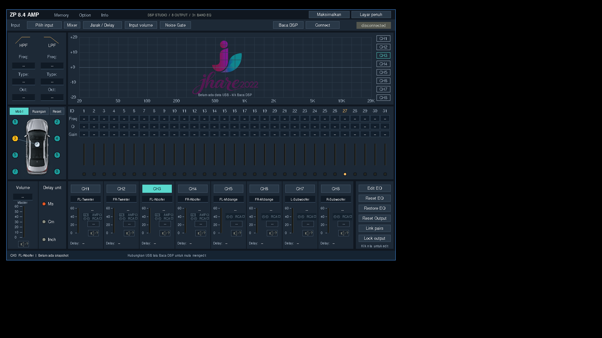

# ZP 8.4 AMP — Linux DSP Editor

A native Linux control app for the Zevox ZP 8.4 car amplifier. No vendor
software, no Electron, no runtime dependencies beyond a C11 compiler and
Xlib. The USB protocol was recovered from the vendor PC tool and the
parameter map was confirmed against real hardware.



| | |
|---|---|
| Device | `Bus 003 Device 005: ID 4084:4357 Nuvoton HID Transfer` |
| Node | `/dev/hidraw*`, udev symlink `/dev/zp84amp` |
| Verified on | Linux, x86_64, 29 September 2026 |
| Language | C11, ~15k lines, Xlib + hidraw |

## What it does

- **Console mixer layout** mirroring the vendor panel: input and mixer,
  crossover, live EQ curve, 31 band EQ table with faders, channel overlay
  picker, car diagram, master volume, unit delay, and eight output strips.
- **Reads and writes the amplifier** over USB. Verified parameters include
  HPF/LPF frequency and filter code, EQ frequency/gain/Q, channel level,
  phase, and delay.
- **Browser UI** as an alternative front end, served by a single static
  binary on `http://127.0.0.1:8085`.
- **Local simulation mode** so the UI can be exercised with no amplifier
  plugged in.
- **Snapshot and diff tooling** (`zpsniff`) that reads all 1,934 parameter
  ids and writes a plain text baseline you can diff between two states.

## Requirements

- Linux with hidraw support
- gcc or clang, make
- `libx11-dev` (or equivalent) for the GUI binary
- The amplifier, reachable as `/dev/zp84amp` after the udev rule is installed

`zp84web` and `zpsniff` need no X11 at all.

## Build

```sh
make            # zpsniff + zp84gui
make web        # zp84web only, no X11 needed
make test       # build and run the test binaries
```

Everything lands in `build/`.

Prebuilt stripped binaries for x86_64 Linux are in
[`release/linux-x86_64/`](release/linux-x86_64) with a
[`SHA256SUMS`](release/SHA256SUMS) manifest:

```sh
sha256sum -c release/SHA256SUMS
```

## Install

The install script builds, copies the binaries into `~/.local/bin`,
registers a desktop entry, and installs the web assets:

```sh
./scripts/install-app.sh
```

Grant access to the amplifier once, as root:

```sh
sudo install -m 0644 scripts/99-zp84.rules /etc/udev/rules.d/
sudo udevadm control --reload-rules
sudo udevadm trigger --subsystem-match=hidraw
```

Until that is done, run the app with `sudo`.

## Run

```sh
zp84gui --read-dsp          # open and read the amplifier immediately
zp84gui --read-dsp --scale 1.5
zp84web                     # browser UI on 127.0.0.1:8085
zpsniff ping                # check the amplifier answers
zpsniff snap -o baseline.txt
```

`--scale` accepts 0.75 to 2.5. The window is resizable and every panel
re-lays out proportionally so the 31 EQ columns are never clipped.

## USB permission

The amplifier appears as a vendor HID device with 64-byte interrupt
endpoints and no report ID. hidraw wants exactly 64 bytes per transfer; the
Windows HID API wants a leading `0x00`. Throughput is capped at 64 KB/s,
so **audio cannot flow over USB** — the PC feeds the amp over analog RCA
and USB carries configuration only.

## Layout

```
src/hid/     hidraw transport and the AE 1E len tag / 80 len cmd .. CRC16 framing
src/dsp/     biquad design, filter families, fixed point, the autoeq solver
src/gui/     the Xlib console: layout, controls, presets, embedded assets
src/web/     the HTTP server and its inlined UI
tests/       frame, math, and console data tests
tools/       zpsniff (C) plus zpdecode.py and diffdump.py
docs/        protocol notes, console mapping, USB verification, tutorials
web/         UI assets served by zp84web
examples     reference captures under "Default Project/"
```

## Documentation

- [docs/PROTOCOL.md](docs/PROTOCOL.md) — frame format, commands, what is
  confirmed versus still open
- [docs/CONSOLE-MAPPING.md](docs/CONSOLE-MAPPING.md) — parameter id to
  control mapping
- [docs/USB-VERIFICATION.md](docs/USB-VERIFICATION.md) — what was actually
  observed on hardware
- [docs/DESKTOP-UI.md](docs/DESKTOP-UI.md) — UI behaviour and interaction
- [docs/VIDEO-TUTORIAL-SCRIPT.md](docs/VIDEO-TUTORIAL-SCRIPT.md) and
  [docs/tutorial.html](docs/tutorial.html)

## Tests

`make test` runs 46 checks across frame handling, filter maths, and the
console data tables, all against real vendor constants.

---

# Bahasa Indonesia

Aplikasi kontrol native Linux untuk amplifier mobil Zevox ZP 8.4. Tanpa
aplikasi vendor, tanpa Electron, tanpa dependency runtime selain compiler
C11 dan Xlib. Protokol USB direkonstruksi dari tool PC vendor, dan peta
parameter sudah diverifikasi pada perangkat asli.

## Kemampuan

- **Tampilan mixer konsol** mengikuti panel vendor: input dan mixer,
  crossover, grafik EQ, tabel 31 band beserta fader, pemilih channel,
  diagram mobil, master volume, unit delay, dan delapan strip output.
- **Membaca dan menulis ke amplifier** lewat USB. Parameter terverifikasi
  mencakup frekuensi dan kode filter HPF/LPF, frekuensi/gain/Q EQ, level,
  fase, dan delay per channel.
- **UI browser** sebagai alternatif, dilayani satu binary statis di
  `http://127.0.0.1:8085`.
- **Mode simulasi lokal** supaya UI bisa dicoba tanpa amplifier terhubung.
- **Alat snapshot dan diff** (`zpsniff`) yang membaca 1.934 id parameter
  dan menulis baseline teks yang bisa dibandingkan antar kondisi.

## Kebutuhan

- Linux dengan dukungan hidraw
- gcc atau clang, make
- `libx11-dev` untuk binary GUI
- Amplifier yang sudah muncul sebagai `/dev/zp84amp` setelah aturan udev dipasang

`zp84web` dan `zpsniff` tidak butuh X11 sama sekali.

## Build

```sh
make            # zpsniff + zp84gui
make web        # zp84web saja, tanpa X11
make test       # build dan jalankan test
```

Binary hasil build ada di `build/`. Binary siap pakai untuk Linux x86_64
juga tersedia di [`release/linux-x86_64/`](release/linux-x86_64) beserta
manifest [`SHA256SUMS`](release/SHA256SUMS).

## Instalasi

```sh
./scripts/install-app.sh
```

Izin akses amplifier, sekali jalan sebagai root:

```sh
sudo install -m 0644 scripts/99-zp84.rules /etc/udev/rules.d/
sudo udevadm control --reload-rules
sudo udevadm trigger --subsystem-match=hidraw
```

Sebelum itu selesai, jalankan aplikasinya dengan `sudo`.

## Menjalankan

```sh
zp84gui --read-dsp          # buka langsung dan baca amplifier
zp84gui --read-dsp --scale 1.5
zp84web                     # UI browser di 127.0.0.1:8085
zpsniff ping                # cek amplifier merespons
zpsniff snap -o baseline.txt
```

## Catatan penting

Batas throughput USB adalah 64 KB/s, jadi **audio tidak bisa mengalir lewat
USB**. PC memberi feed ke amplifier lewat RCA analog; USB hanya membawa
konfigurasi.

## Dokumentasi

- [docs/PROTOCOL.md](docs/PROTOCOL.md) — format frame, daftar perintah,
  mana yang sudah terkonfirmasi dan mana yang masih terbuka
- [docs/CONSOLE-MAPPING.md](docs/CONSOLE-MAPPING.md) — pemetaan id parameter
  ke kontrol
- [docs/USB-VERIFICATION.md](docs/USB-VERIFICATION.md) — apa yang benar-benar
  diamati di perangkat
- [docs/DESKTOP-UI.md](docs/DESKTOP-UI.md) — perilaku dan interaksi UI

## Test

`make test` menjalankan 46 pemeriksaan covering frame, matematika filter,
dan tabel data konsol, semuanya memakai konstanta asli vendor.

---

## License

Not yet specified. Add a `LICENSE` file before redistributing.

## Status

Reverse engineering of the parameter id space is still in progress. The
mapping above covers the controls the vendor PC tool exposes; the
remaining ids are listed but not yet named. See the status table in
[docs/PROTOCOL.md](docs/PROTOCOL.md).
